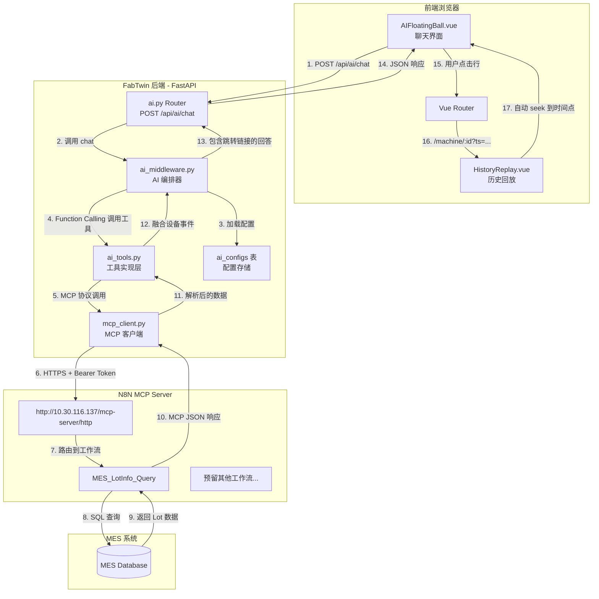
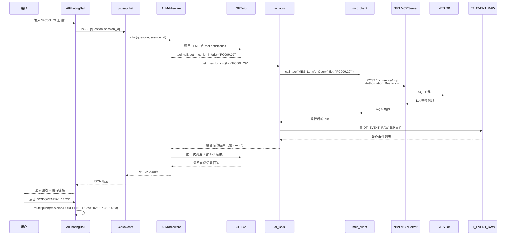

# FabTwin AI 第一阶段（MVP）详细技术设计

> 版本：v1.0
> 更新时间：2026-07-28
> 配套文档：[AI_Architecture_Design.md](file:///C:/Users/A/AppData/Roaming/TRAE%20SOLO%20CN/ModularData/ai-agent/work-mode-projects/6a558d0e1709fecd225c0cc2/fab-twin-pro/docs/AI_Architecture_Design.md)
> 状态：等待评审，评审通过后进入开发

---

## 一、目标与范围

### 1.1 阶段目标（MVP）
让 AI 助手能：
1. 接收用户在 [AIFloatingBall.vue](file:///C:/Users/A/AppData/Roaming/TRAE%20SOLO%20CN/ModularData/ai-agent/work-mode-projects/6a558d0e1709fecd225c0cc2/fab-twin-pro/frontend/src/components/AIFloatingBall.vue) 的提问
2. 通过 **MCP 协议**自动调用 N8N 上的 `MES_LotInfo_Query` 工具
3. 融合 MES 返回的产品/工艺/状态信息 与 FabTwin 的设备事件流
4. 在 AI 回答中返回 **可点击跳转** 的机台+时间点

### 1.2 范围（In Scope）
- MCP HTTP 协议客户端开发
- Token 配置化（后台录入 + DB 持久化）
- 1 个 MCP 工具（`MES_LotInfo_Query`）的注册与调用
- Lot ID 解析规则升级
- Lot 追溯双源数据融合
- 前端 AI 表格行点击 → 跳转 `MachineDetail` + 时间游标定位

### 1.3 范围外（Out of Scope，下一阶段）
- Dify RAG 集成
- 多 N8N 工具批量配置 UI
- 主动推送（告警自动触发 AI）
- 批量 Lot 查询

---

## 二、整体技术架构

### 2.1 分层架构图



### 2.2 数据流时序



---

## 三、MCP 协议详解

### 3.1 MCP 协议背景
**Model Context Protocol (MCP)** 是 Anthropic 提出的标准协议，用于让 LLM 调用外部工具/数据源。

- **传输层**：支持 `stdio` / `http` / `sse`
- **消息格式**：JSON-RPC 2.0
- **核心能力**：`tools/list`（发现工具）、`tools/call`（调用工具）

### 3.2 你提供的 MCP 接入信息
- **URL**：`http://10.30.116.137/mcp-server/http`
- **鉴权**：`Authorization: Bearer <YOUR_ACCESS_TOKEN_HERE>`（固定 Token）
- **工具示例**：`MES_LotInfo_Query`

### 3.3 HTTP 模式 MCP 调用格式

#### A. 列出可用工具
```http
POST /mcp-server/http HTTP/1.1
Host: 10.30.116.137
Authorization: Bearer <token>
Content-Type: application/json

{
  "jsonrpc": "2.0",
  "id": 1,
  "method": "tools/list"
}
```

**响应**：
```json
{
  "jsonrpc": "2.0",
  "id": 1,
  "result": {
    "tools": [
      {
        "name": "MES_LotInfo_Query",
        "description": "查询 Lot 详细信息",
        "inputSchema": {
          "type": "object",
          "properties": {
            "lot": {"type": "string", "description": "Lot ID"}
          },
          "required": ["lot"]
        }
      }
    ]
  }
}
```

#### B. 调用工具
```http
POST /mcp-server/http HTTP/1.1
Host: 10.30.116.137
Authorization: Bearer <token>
Content-Type: application/json

{
  "jsonrpc": "2.0",
  "id": 2,
  "method": "tools/call",
  "params": {
    "name": "MES_LotInfo_Query",
    "arguments": {"lot": "PC00H.29"}
  }
}
```

**响应**（你提供的真实样例）：
```json
{
  "jsonrpc": "2.0",
  "id": 2,
  "result": {
    "content": [
      {
        "type": "text",
        "text": "[{\"success\":true,\"lot\":\"PC00H.29\",...}]"
      }
    ]
  }
}
```

### 3.4 我们的封装策略
不直接用 `mcp` Python SDK（重、引入复杂依赖），**手写一个轻量 HTTP 客户端**：
- 只用 `requests` 库
- 100 行内代码
- 支持 `tools/list` 和 `tools/call`
- Token 动态注入（从 DB 读）

---

## 四、模块设计

### 4.1 新增文件清单

| 文件 | 类型 | 职责 |
|------|------|------|
| [backend/services/mcp_client.py](file:///C:/Users/A/AppData/Roaming/TRAE%20SOLO%20CN/ModularData/ai-agent/work-mode-projects/6a558d0e1709fecd225c0cc2/fab-twin-pro/backend/services/mcp_client.py) | 新增 | MCP HTTP 协议客户端（轻量封装） |
| [backend/services/mcp_registry.py](file:///C:/Users/A/AppData/Roaming/TRAE%20SOLO%20CN/ModularData/ai-agent/work-mode-projects/6a558d0e1709fecd225c0cc2/fab-twin-pro/backend/services/mcp_registry.py) | 新增 | MCP 工具注册表（描述信息 + 路由配置） |
| [backend/migrations/v2.1_add_mcp_config.sql](file:///C:/Users/A/AppData/Roaming/TRAE%20SOLO%20CN/ModularData/ai-agent/work-mode-projects/6a558d0e1709fecd225c0cc2/fab-twin-pro/sql/v2.1_add_mcp_config.sql) | 新增 | 4 个 MCP 配置键的 INSERT/UPDATE 脚本 |
| 改 [backend/services/ai_tools.py](file:///C:/Users/A/AppData/Roaming/TRAE%20SOLO%20CN/ModularData/ai-agent/work-mode-projects/6a558d0e1709fecd225c0cc2/fab-twin-pro/backend/services/ai_tools.py) | 修改 | 新增 `get_mes_lot_info` + 改造 `get_lot_info` 双源融合 |
| 改 [backend/services/ai_middleware.py](file:///C:/Users/A/AppData/Roaming/TRAE%20SOLO%20CN/ModularData/ai-agent/work-mode-projects/6a558d0e1709fecd225c0cc2/fab-twin-pro/backend/services/ai_middleware.py) | 修改 | 更新 Lot ID 正则 + System Prompt |
| 改 [frontend/src/components/AIConfigPanel.vue](file:///C:/Users/A/AppData/Roaming/TRAE%20SOLO%20CN/ModularData/ai-agent/work-mode-projects/6a558d0e1709fecd225c0cc2/fab-twin-pro/frontend/src/components/AIConfigPanel.vue) | 修改 | Dify/N8N Tab 增加 MCP Server 配置项 |
| 改 [frontend/src/components/AIFloatingBall.vue](file:///C:/Users/A/AppData/Roaming/TRAE%20SOLO%20CN/ModularData/ai-agent/work-mode-projects/6a558d0e1709fecd225c0cc2/fab-twin-pro/frontend/src/components/AIFloatingBall.vue) | 修改 | 表格行点击跳转 MachineDetail |
| 改 [frontend/src/views/MachineDetail.vue](file:///C:/Users/A/AppData/Roaming/TRAE%20SOLO%20CN/ModularData/ai-agent/work-mode-projects/6a558d0e1709fecd225c0cc2/fab-twin-pro/frontend/src/views/MachineDetail.vue) | 修改 | 接收 `?ts=` query 自动定位回放游标 |
| 改 [frontend/src/App.vue](file:///C:/Users/A/AppData/Roaming/TRAE%20SOLO%20CN/ModularData/ai-agent/work-mode-projects/6a558d0e1709fecd225c0cc2/fab-twin-pro/frontend/src/App.vue) | 修改 | `handleAIJump` 路由携带 ts 参数 |

### 4.2 核心类设计

#### 4.2.1 [MCPClient](file:///C:/Users/A/AppData/Roaming/TRAE%20SOLO%20CN/ModularData/ai-agent/work-mode-projects/6a558d0e1709fecd225c0cc2/fab-twin-pro/backend/services/mcp_client.py)

```python
class MCPClient:
    """轻量 MCP HTTP 客户端"""

    def __init__(self, base_url: str, token: str, timeout: int = 30):
        self.base_url = base_url.rstrip('/')
        self.token = token
        self.timeout = timeout

    def _request(self, method: str, params: dict = None) -> dict:
        """发送 JSON-RPC 2.0 请求"""
        payload = {
            "jsonrpc": "2.0",
            "id": int(time.time() * 1000),
            "method": method,
        }
        if params:
            payload["params"] = params

        resp = requests.post(
            self.base_url,
            json=payload,
            headers={
                "Content-Type": "application/json",
                "Authorization": f"Bearer {self.token}",
            },
            timeout=self.timeout,
        )
        resp.raise_for_status()
        data = resp.json()

        if "error" in data:
            raise MCPCallError(data["error"])

        return data.get("result", {})

    def list_tools(self) -> List[dict]:
        """获取 MCP Server 注册的所有工具"""
        result = self._request("tools/list")
        return result.get("tools", [])

    def call_tool(self, name: str, arguments: dict) -> Any:
        """调用 MCP 工具"""
        result = self._request("tools/call", {
            "name": name,
            "arguments": arguments,
        })
        # MCP 响应通常把数据放在 content[0].text
        content = result.get("content", [])
        if content and content[0].get("type") == "text":
            text = content[0]["text"]
            try:
                return json.loads(text)  # 文本一般是 JSON 字符串
            except json.JSONDecodeError:
                return text
        return result
```

#### 4.2.2 [MCPRegistry](file:///C:/Users/A/AppData/Roaming/TRAE%20SOLO%20CN/ModularData/ai-agent/work-mode-projects/6a558d0e1709fecd225c0cc2/fab-twin-pro/backend/services/mcp_registry.py)

```python
@dataclass
class MCPToolConfig:
    """单个 MCP 工具的注册信息"""
    name: str                  # AI 工具名（给 GPT-4o 看）
    description: str           # 自然语言描述（决定 GPT-4o 是否调用）
    mcp_server_name: str       # 哪个 MCP Server
    mcp_tool_name: str         # N8N 上的工作流名
    parameters: dict           # 参数 schema
    param_mapping: dict        # 参数映射规则 {ai_param: mcp_param}
    keywords: List[str]        # 关键词兜底

# 全局注册表
MCP_REGISTRY = {
    "get_mes_lot_info": MCPToolConfig(
        name="get_mes_lot_info",
        description="查询 MES 系统中的 Lot 详细信息。返回 product(产品型号)、process(工艺)、route(路线)、step(步骤)、lotjobstatus(状态: RUN/HOLD/COMPLETE)、currentquantity(晶圆数量)、cassette(花篮号)。当用户提到具体 Lot ID 并询问产品、状态、步骤、数量、属于什么工艺时，必须调用此工具。",
        mcp_server_name="n8n-main",
        mcp_tool_name="MES_LotInfo_Query",
        parameters={
            "type": "object",
            "properties": {
                "lot": {"type": "string", "description": "Lot ID，如 PC00H.29 或 NT938"}
            },
            "required": ["lot"]
        },
        param_mapping={"lot": "lot"},
        keywords=["lot", "批次", "产品", "工艺", "状态", "晶圆", "花篮"],
    ),
    # 后续用户可在 ai_provider_configs 类似表里加更多
}
```

### 4.3 工具层改造方案

#### 4.3.1 新增 `get_mes_lot_info` 工具

```python
# 在 ai_tools.py 中追加

def get_mes_lot_info(db: Session, lot_id: str) -> dict:
    """通过 MCP 调用 N8N MES_LotInfo_Query"""
    # 1. 从 ai_configs 读 MCP Token 和 URL
    mcp_url = _get_config_value("mcp_n8n_url", "http://10.30.116.137/mcp-server/http")
    mcp_token = _get_config_value("mcp_n8n_token", "")

    if not mcp_token:
        return {"answer": "⚠️ N8N MCP Token 未配置，请在 AI 配置面板中录入。", "sql": ""}

    # 2. 调用 MCP
    client = MCPClient(mcp_url, mcp_token)
    raw = client.call_tool("MES_LotInfo_Query", {"lot": lot_id})

    # 3. 解析 N8N 返回（你的样例是数组包一层）
    if isinstance(raw, list) and raw:
        data = raw[0]
    elif isinstance(raw, dict):
        data = raw
    else:
        return {"answer": f"Lot {lot_id} 未查询到数据。", "sql": ""}

    if not data.get("success"):
        return {"answer": f"Lot {lot_id} 查询失败：{data.get('message', '未知错误')}", "sql": ""}

    # 4. 构造 AI 友好的自然语言回答
    rows = data.get("data", {}).get("rows", [])
    if not rows:
        return {"answer": f"Lot {lot_id} 在 MES 中无记录。", "sql": ""}

    row = rows[0]
    answer = (
        f"📦 Lot **{lot_id}** MES 信息：\n"
        f"• 产品：{row.get('product', 'N/A')}\n"
        f"• 当前工艺：{row.get('process', 'N/A')} (版本 {row.get('processversion', 'N/A')})\n"
        f"• 工艺路线：{row.get('route', 'N/A')}\n"
        f"• 当前步骤：{row.get('step', 'N/A')}\n"
        f"• 状态：{row.get('lotjobstatus', 'N/A')}\n"
        f"• 晶圆数量：{row.get('currentquantity', 'N/A')}\n"
        f"• 花篮号：{row.get('cassette', 'N/A')}\n"
        f"• Lot 类型：{row.get('lottype', 'N/A')}\n"
        f"• Wafer 类型：{row.get('wafertype', 'N/A')}\n"
    )

    # 5. 表格数据
    table_data = {
        "headers": list(row.keys()),
        "rows": [[str(v) for v in row.values()]],
    }

    return {
        "answer": answer,
        "sql": f"-- MCP call: MES_LotInfo_Query(lot='{lot_id}')",
        "table_data": table_data,
    }
```

#### 4.3.2 改造 `get_lot_info` 实现双源融合

```python
def get_lot_info(db: Session, lot_id: str = None, machine_id: str = None,
                 use_mes: bool = True) -> dict:
    """Lot 查询：MES 信息 + 设备事件融合"""

    if not lot_id:
        return {"answer": "请提供 Lot ID。", "sql": ""}

    result = {"answer": "", "sql": "", "table_data": None, "jump_timestamp": None, "jump_machine_id": None}

    # 1. 先查 MES（如果启用且配置了 Token）
    mes_info = None
    if use_mes and _get_config_value("mcp_n8n_token", ""):
        try:
            mes_result = get_mes_lot_info(db, lot_id)
            # 提取 MES 数据用于融合
            if mes_result.get("table_data") and mes_result["table_data"]["rows"]:
                mes_row = dict(zip(mes_result["table_data"]["headers"],
                                   mes_result["table_data"]["rows"][0]))
                mes_info = mes_row
            result["answer"] += mes_result.get("answer", "") + "\n\n"
        except Exception as e:
            result["answer"] += f"⚠️ MES 查询失败：{e}\n\n"

    # 2. 查 FabTwin DT_EVENT_RAW 设备事件
    events = db.query(DT_EVENT_RAW).filter(
        DT_EVENT_RAW.payload_json.like(f'%{lot_id}%')
    ).order_by(DT_EVENT_RAW.raw_id.desc()).limit(50).all()

    if events:
        result["answer"] += f"🏭 FabTwin 设备事件（共 {len(events)} 条）：\n"

        # 聚合：每个机台最新的事件
        machine_latest = {}
        for e in events:
            payload = _parse_payload(e.payload_json)
            mid = e.tool_id
            if mid not in machine_latest:
                machine_latest[mid] = {
                    "timestamp": e.received_ts_utc,
                    "event": payload.get("event_name", ""),
                    "state": payload.get("machine_state", ""),
                    "mode": payload.get("machine_mode", ""),
                }

        # 构造时间线表格
        timeline_rows = []
        for mid, info in machine_latest.items():
            timeline_rows.append([
                info["timestamp"], mid, info["event"], info["state"], info["mode"]
            ])

        result["table_data"] = {
            "headers": ["时间", "机台", "事件", "状态", "模式"],
            "rows": timeline_rows,
        }

        # 跳转：默认跳到最新事件所在机台
        if machine_latest:
            first_mid = list(machine_latest.keys())[0]
            first_ts = machine_latest[first_mid]["timestamp"]
            result["jump_machine_id"] = first_mid
            result["jump_timestamp"] = first_ts
            result["answer"] += f"\n📍 最近事件在 **{first_mid}** ({first_ts})，可点击下方行跳转查看。"

    return result
```

### 4.4 中间件改动

#### 4.4.1 Lot ID 正则升级（[_extract_lot_id](file:///C:/Users/A/AppData/Roaming/TRAE%20SOLO%20CN/ModularData/ai-agent/work-mode-projects/6a558d0e1709fecd225c0cc2/fab-twin-pro/backend/services/ai_middleware.py)）

```python
def _extract_lot_id(self, question: str) -> str:
    """从自然语言中提取 Lot ID
    支持格式：NT938, VC001, P0093, NT938.15
    """
    # 优先匹配带点号的分片 Lot（如 NT938.15）
    match = re.search(r'\b([A-Z]+\d+\.\d+)\b', question.upper())
    if match:
        return match.group(1)
    # 再匹配主 Lot（如 NT938, VC001, P0093）
    match = re.search(r'\b([A-Z]+\d+)\b', question.upper())
    if match:
        return match.group(1)
    return None
```

#### 4.4.2 System Prompt 增强

在 [_build_system_prompt](file:///C:/Users/A/AppData/Roaming/TRAE%20SOLO%20CN/ModularData/ai-agent/work-mode-projects/6a558d0e1709fecd225c0cc2/fab-twin-pro/backend/services/ai_middleware.py) 中追加：

```python
prompt = """你是 FabTwin AI 数字孪生平台的智能助手。
你可以调用以下工具查询业务数据：

1. get_mes_lot_info: 查询 MES 系统 Lot 信息（产品/工艺/步骤/状态/晶圆数量）
   - 必填参数：lot (Lot ID)
   - 适用场景：用户提到具体 Lot ID 并询问产品、状态、晶圆数量

2. get_lot_info: 查询 Lot 完整追溯信息（MES + 设备事件融合）
   - 必填参数：lot
   - 适用场景：用户问"Lot 追溯"、"Lot 走过哪些机台"

3. get_machine_status: 查询机台实时状态
4. get_machine_alarms: 查询告警
5. get_event_timeline: 查询机台事件时间线
6. get_yield_stats: 查询产量统计

调用策略：
- 用户问"PC00H.29 是什么产品、什么状态" → get_mes_lot_info
- 用户问"PC00H.29 走过哪些机台" → get_lot_info（含 MES+设备）
- 用户问"PC00H.29 追溯"或"PC00H.29 完整信息" → get_lot_info

数据展示：
- 表格数据可点击跳转（如果带 jump_* 字段）
- 不要编造数据，所有数据必须通过工具调用获取
"""
```

### 4.5 工具注册表更新

把新工具追加到 [ai_tools.py](file:///C:/Users/A/AppData/Roaming/TRAE%20SOLO%20CN/ModularData/ai-agent/work-mode-projects/6a558d0e1709fecd225c0cc2/fab-twin-pro/backend/services/ai_tools.py) 的 `TOOL_DEFINITIONS`：

```python
TOOL_DEFINITIONS = [
    # ... 原有 6 个工具 ...
    {
        "type": "function",
        "function": {
            "name": "get_mes_lot_info",
            "description": "查询 MES 系统的 Lot 详细信息，包括 product（产品）、process（工艺）、route（路线）、step（步骤）、lotjobstatus（状态）、currentquantity（晶圆数量）、cassette（花篮）。适用：用户提到具体 Lot ID 并询问产品/状态/晶圆数。",
            "parameters": {
                "type": "object",
                "properties": {
                    "lot": {"type": "string", "description": "Lot ID，如 PC00H.29、NT938、NT938.15"}
                },
                "required": ["lot"]
            }
        }
    },
]

TOOL_HANDLERS["get_mes_lot_info"] = get_mes_lot_info
```

---

## 五、数据库设计

### 5.1 复用的现有表
- [ai_configs](file:///C:/Users/A/AppData/Roaming/TRAE%20SOLO%20CN/ModularData/ai-agent/work-mode-projects/6a558d0e1709fecd225c0cc2/fab-twin-pro/sql/create_ai_tables.sql)（键值对表）：直接插入 MCP 相关键

### 5.2 新增配置项

| config_key | config_value 示例 | 说明 |
|------------|------------------|------|
| `mcp_n8n_enabled` | `true` | 是否启用 N8N MCP |
| `mcp_n8n_url` | `http://10.30.116.137/mcp-server/http` | N8N MCP Server 地址 |
| `mcp_n8n_token` | `<用户的真实 token>` | Bearer Token |
| `mcp_n8n_timeout` | `30` | HTTP 超时秒数 |

### 5.3 初始化 SQL

[v2.1_add_mcp_config.sql](file:///C:/Users/A/AppData/Roaming/TRAE%20SOLO%20CN/ModularData/ai-agent/work-mode-projects/6a558d0e1709fecd225c0cc2/fab-twin-pro/sql/v2.1_add_mcp_config.sql)：

```sql
-- v2.1: AI - N8N MCP 配置
MERGE INTO ai_configs t
USING (SELECT 'mcp_n8n_enabled' AS config_key FROM dual) s
ON (t.config_key = s.config_key)
WHEN NOT MATCHED THEN
  INSERT (config_key, config_value, description, updated_at, updated_by)
  VALUES ('mcp_n8n_enabled', 'false', '是否启用 N8N MCP Server', TO_CHAR(SYSDATE, 'YYYY-MM-DD HH24:MI:SS'), 'system');

MERGE INTO ai_configs t
USING (SELECT 'mcp_n8n_url' AS config_key FROM dual) s
ON (t.config_key = s.config_key)
WHEN NOT MATCHED THEN
  INSERT (config_key, config_value, description, updated_at, updated_by)
  VALUES ('mcp_n8n_url', 'http://10.30.116.137/mcp-server/http', 'N8N MCP Server 地址', TO_CHAR(SYSDATE, 'YYYY-MM-DD HH24:MI:SS'), 'system');

MERGE INTO ai_configs t
USING (SELECT 'mcp_n8n_token' AS config_key FROM dual) s
ON (t.config_key = s.config_key)
WHEN NOT MATCHED THEN
  INSERT (config_key, config_value, description, updated_at, updated_by)
  VALUES ('mcp_n8n_token', '', 'N8N MCP Bearer Token', TO_CHAR(SYSDATE, 'YYYY-MM-DD HH24:MI:SS'), 'system');

MERGE INTO ai_configs t
USING (SELECT 'mcp_n8n_timeout' AS config_key FROM dual) s
ON (t.config_key = s.config_key)
WHEN NOT MATCHED THEN
  INSERT (config_key, config_value, description, updated_at, updated_by)
  VALUES ('mcp_n8n_timeout', '30', 'N8N MCP HTTP 超时（秒）', TO_CHAR(SYSDATE, 'YYYY-MM-DD HH24:MI:SS'), 'system');

COMMIT;
```

---

## 六、前端设计

### 6.1 AIConfigPanel 改动

在 [AIConfigPanel.vue](file:///C:/Users/A/AppData/Roaming/TRAE%20SOLO%20CN/ModularData/ai-agent/work-mode-projects/6a558d0e1709fecd225c0cc2/fab-twin-pro/frontend/src/components/AIConfigPanel.vue) 的 Dify/N8N Tab 中，在 Dify 配置前增加"MCP Server (N8N)"区块：

```vue
<!-- MCP Server 配置 -->
<div class="mcp-section">
  <div class="section-header">
    <span class="section-title">MCP Server (N8N)</span>
    <label class="switch">
      <input type="checkbox" v-model="mcpConfig.mcp_n8n_enabled" />
      <span class="slider"></span>
    </label>
  </div>

  <div class="form-row">
    <label>服务地址</label>
    <input v-model="mcpConfig.mcp_n8n_url" placeholder="http://10.30.116.137/mcp-server/http" />
  </div>

  <div class="form-row">
    <label>Bearer Token</label>
    <input v-model="mcpConfig.mcp_n8n_token" type="password"
           placeholder="请填入 N8N MCP Token" />
  </div>

  <div class="form-row">
    <label>超时（秒）</label>
    <input v-model.number="mcpConfig.mcp_n8n_timeout" type="number" min="5" max="120" />
  </div>

  <div class="form-actions">
    <button @click="testMcpConnection" :disabled="testingMcp">测试连接</button>
    <button class="primary" @click="saveMcpConfig" :disabled="loading">保存</button>
  </div>

  <!-- 已发现的工具列表（动态拉取） -->
  <div v-if="mcpTools.length" class="mcp-tools">
    <h4>已发现工具（{{ mcpTools.length }}）</h4>
    <div v-for="t in mcpTools" :key="t.name" class="mcp-tool-item">
      <span class="tool-name">{{ t.name }}</span>
      <span class="tool-desc">{{ t.description }}</span>
    </div>
  </div>
</div>
```

### 6.2 AIFloatingBall 表格点击跳转

修改 [AIFloatingBall.vue](file:///C:/Users/A/AppData/Roaming/TRAE%20SOLO%20CN/ModularData/ai-agent/work-mode-projects/6a558d0e1709fecd225c0cc2/fab-twin-pro/frontend/src/components/AIFloatingBall.vue) 的 `msg-table` 渲染逻辑：

```vue
<div v-if="msg.table_data && msg.table_data.rows.length" class="msg-table">
  <table>
    <thead>
      <tr>
        <th v-for="h in msg.table_data.headers" :key="h">{{ h }}</th>
        <th v-if="msg.jump_timestamp">操作</th>
      </tr>
    </thead>
    <tbody>
      <tr v-for="(row, ri) in msg.table_data.rows" :key="ri">
        <td v-for="(cell, ci) in row" :key="ci">{{ cell }}</td>
        <td v-if="msg.jump_timestamp">
          <button class="row-jump-btn"
                  @click="jumpToTime({ machine_id: msg.jump_machine_id, timestamp: msg.jump_timestamp })">
            📍 跳转
          </button>
        </td>
      </tr>
    </tbody>
  </table>
</div>
```

### 6.3 App.vue 路由跳转

[App.vue](file:///C:/Users/A/AppData/Roaming/TRAE%20SOLO%20CN/ModularData/ai-agent/work-mode-projects/6a558d0e1709fecd225c0cc2/fab-twin-pro/frontend/src/App.vue) 的 `handleAIJump`：

```javascript
function handleAIJump(payload) {
  // payload: { machine_id, timestamp }
  if (!payload || !payload.machine_id) return;
  const ts = encodeURIComponent(payload.timestamp || '');
  router.push({
    path: `/machine/${payload.machine_id}`,
    query: { ts, from: 'ai' }
  });
}
```

### 6.4 MachineDetail 自动定位

[MachineDetail.vue](file:///C:/Users/A/AppData/Roaming/TRAE%20SOLO%20CN/ModularData/ai-agent/work-mode-projects/6a558d0e1709fecd225c0cc2/fab-twin-pro/frontend/src/views/MachineDetail.vue) 在 onMounted 阶段检查 query：

```javascript
import { useRoute } from 'vue-router';
const route = useRoute();

onMounted(() => {
  // ... 已有逻辑 ...

  // 如果来自 AI 跳转的 ts 参数
  if (route.query.ts) {
    const ts = decodeURIComponent(route.query.ts);
    // 触发历史回放定位
    jumpToTime(ts);
    // 提示用户
    ElMessage.info(`已自动跳转到 ${ts} 时段`);
  }
});
```

---

## 七、测试方案

### 7.1 单元测试（自测脚本）

[scripts/test_ai_phase1.py](file:///C:/Users/A/AppData/Roaming/TRAE%20SOLO%20CN/ModularData/ai-agent/work-mode-projects/6a558d0e1709fecd225c0cc2/fab-twin-pro/scripts/test_ai_phase1.py)：

```python
"""第一阶段 AI 链路自测"""

def test_mcp_client():
    """测试 MCP 客户端"""
    from services.mcp_client import MCPClient
    client = MCPClient("http://10.30.116.137/mcp-server/http", "<token>")
    tools = client.list_tools()
    assert len(tools) > 0
    print(f"发现 {len(tools)} 个工具: {[t['name'] for t in tools]}")

def test_mes_lot_info():
    """测试 MES Lot 查询"""
    from services.ai_tools import get_mes_lot_info
    from database import SessionLocal
    db = SessionLocal()
    result = get_mes_lot_info(db, lot_id="PC00H.29")
    assert "PC00H.29" in result["answer"]
    print("MES 查询成功:", result["answer"][:200])

def test_lot_fusion():
    """测试双源融合"""
    from services.ai_tools import get_lot_info
    from database import SessionLocal
    db = SessionLocal()
    result = get_lot_info(db, lot_id="PC00H.29")
    assert "MES" in result["answer"]
    assert result.get("jump_machine_id")
    print("融合成功，跳转:", result["jump_machine_id"], result["jump_timestamp"])

def test_lot_id_regex():
    """测试 Lot ID 正则"""
    from services.ai_middleware import AIMiddleware
    mw = AIMiddleware()
    assert mw._extract_lot_id("PC00H.29 状态") == "PC00H.29"
    assert mw._extract_lot_id("NT938 追溯") == "NT938"
    assert mw._extract_lot_id("查一下 NT938.15") == "NT938.15"
    assert mw._extract_lot_id("VC001 在哪") == "VC001"
    print("正则通过")
```

### 7.2 端到端测试流程

| 步骤 | 操作 | 预期结果 |
|------|------|----------|
| 1 | 在 AI 配置面板录入 MCP Token 并保存 | 显示"保存成功" |
| 2 | 点击"测试连接"按钮 | 调用 `tools/list`，显示已发现工具数 |
| 3 | 打开 AI 悬浮球，输入"PC00H.29 追溯" | GPT-4o 调用 `get_mes_lot_info` |
| 4 | AI 回答包含 MES 信息 + 设备事件表格 | 有产品、状态、晶圆数、机台时间线 |
| 5 | 点击表格行"跳转"按钮 | 跳转到 `/machine/PODOPENER-1?ts=...` |
| 6 | MachineDetail 自动定位回放游标 | 显示对应时间点的事件 |

### 7.3 失败兜底

- **MCP 调用失败**：返回"⚠️ N8N MCP 调用失败：xxx"，并自动降级到本地数据
- **Token 未配置**：返回"⚠️ 请在 AI 配置面板中录入 MCP Token"
- **网络超时**：返回"⚠️ MCP 服务超时（30s）"
- **Lot ID 提取不到**：直接走默认的 `get_machine_status`

---

## 八、风险与应对

| 风险 | 影响 | 应对 |
|------|------|------|
| N8N MCP Server 不稳定 | AI 工具调用失败 | 5s 超时 + 自动降级到本地数据 + 前端友好提示 |
| Token 泄漏 | 安全风险 | DB 存储脱敏显示；前端 Type=password 输入；HTTPS 传输 |
| GPT-4o 选错工具 | 答非所问 | 工具 description 写清楚场景 + 关键词兜底路由 |
| N8N 工作流参数变化 | 调用失败 | 工具注册表参数 schema 化 + 调用前校验 |
| DT_EVENT_RAW 数据稀疏 | 融合表空空 | MES 信息优先展示 + 设备事件标注"暂无" |

---

## 九、开发工时估算

| 任务 | 预计工时 |
|------|---------|
| 1. MCP 客户端开发 [mcp_client.py](file:///C:/Users/A/AppData/Roaming/TRAE%20SOLO%20CN/ModularData/ai-agent/work-mode-projects/6a558d0e1709fecd225c0cc2/fab-twin-pro/backend/services/mcp_client.py) | 0.5 天 |
| 2. 工具注册表 [mcp_registry.py](file:///C:/Users/A/AppData/Roaming/TRAE%20SOLO%20CN/ModularData/ai-agent/work-mode-projects/6a558d0e1709fecd225c0cc2/fab-twin-pro/backend/services/mcp_registry.py) | 0.3 天 |
| 3. DB 配置 SQL 脚本 | 0.1 天 |
| 4. ai_tools.py 新增 get_mes_lot_info + 改造 get_lot_info | 0.5 天 |
| 5. ai_middleware.py 正则 + System Prompt | 0.2 天 |
| 6. AIConfigPanel UI 改造 | 0.5 天 |
| 7. AIFloatingBall 表格跳转 | 0.3 天 |
| 8. App.vue + MachineDetail 路由对接 | 0.3 天 |
| 9. 自测脚本 + 端到端验证 | 0.5 天 |
| **合计** | **约 3.2 天** |

---

## 十、待你最终确认

1. ✅ 文档中给出的工具 description 和调用策略是否符合你的预期？
2. ✅ 双源融合的呈现方式（先 MES 信息，再设备事件表格，最后跳转）是否 OK？
3. ✅ 跳转逻辑（点击"跳转"按钮 → 跳 MachineDetail + 自动 seek）是否清晰？
4. ✅ 工时估算（3.2 天）是否可接受？

确认后我就开始按文件清单顺序动代码，每完成一步先自测再给你看。
